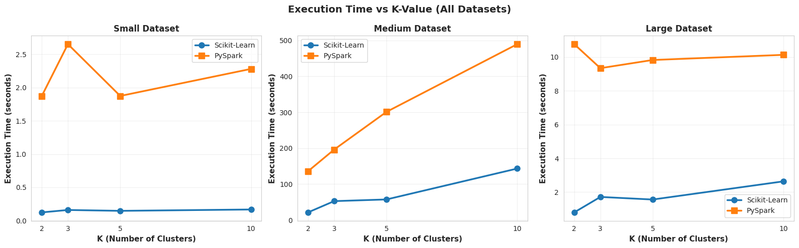
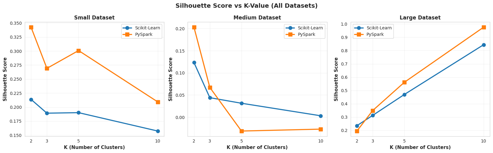
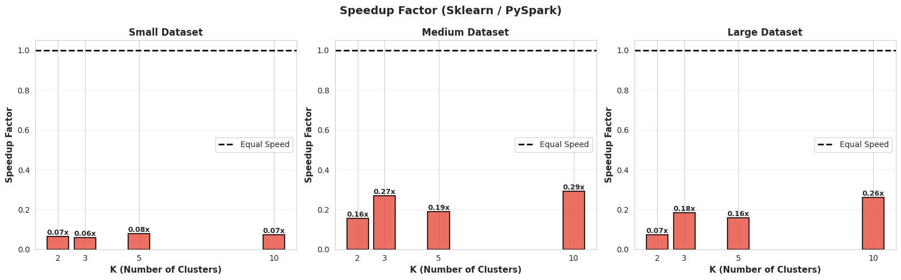

# Big Data Clustering Project: K-means Comparison
## Master 2 Digital Transformation for Industry - Paris Saclay University
### Course: Data Science

### 📌 Project Overview
This project is part of the **Data Science** course curriculum for the **Master 2 Digital Transformation for Industry** at **Paris Saclay University**. It presents a comparative analysis of K-means clustering implementations using two popular frameworks:
1.  **Scikit-Learn**: Standard in-memory machine learning library.
2.  **Apache Spark (PySpark)**: Distributed computing framework for big data processing.

The primary objective is to evaluate and compare the performance (execution time, memory usage, CPU utilization) and clustering quality (Inertia, Silhouette Score) of these frameworks across datasets of varying sizes.

### 📊 Datasets Used
The analysis is performed on three distinct datasets to simulate different data scales:

| Dataset | Size | Samples | Features | Description |
| :--- | :--- | :--- | :--- | :--- |
| **Wine Quality** | Small | ~1,600 | 11 | Real-world dataset from UCI Machine Learning Repository. |
| **MNIST** | Medium | ~70,000 | 784 | High-dimensional handwritten digits dataset. |
| **Synthetic** | Large | 110,000 | 50 | Generated blobs to test scalability. |

### 📈 Key Results Summary
*Based on local execution environment results:*

- **Performance**: Scikit-Learn demonstrated faster execution times for the tested dataset sizes (up to 110k samples) in a local single-node environment. Spark's overhead for distributed task management outweighed its parallel processing benefits at this scale.
- **Scalability**: While Scikit-Learn was more efficient locally, Spark is designed to scale horizontally across clusters, which is critical for datasets exceeding single-machine memory.
- **Quality**: Both implementations achieved comparable clustering quality metrics (Silhouette Score, Inertia), validating the correctness of the algorithms.

### 🛠️ Environment Setup & Installation

Follow these steps to set up the environment and reproduce the analysis.

#### 1. Virtual Environment Creation
A virtual environment isolates project dependencies, preventing conflicts with other Python projects on your system.

```bash
# Create project directory
mkdir big-data-clustering
cd big-data-clustering

# Create virtual environment
python3 -m venv venv

# Activate it
source venv/bin/activate

# Install all required packages
pip install pyspark scikit-learn pandas numpy matplotlib seaborn memory_profiler psutil jupyter tqdm
```

#### 2. Why Each Library?
*   **PySpark**: Distributed computing framework for processing large datasets across clusters.
*   **scikit-learn**: Traditional ML library with optimized single-machine algorithms.
*   **pandas/numpy**: Data manipulation and numerical computation.
*   **matplotlib/seaborn**: Creating visualizations and plots.
*   **memory_profiler/psutil**: Monitoring resource usage during execution.

### 📓 Notebook Walkthrough

The `tp_big_data_clustering.ipynb` notebook is structured into 8 main parts:

#### Part 1: Setup and Imports
Initializes the Python environment by importing necessary libraries. It also configures `warnings` to keep the output clean and sets up plotting styles for `matplotlib` and `seaborn`.

#### Part 2: Initialize Spark Session
Establishes the entry point for programming with Spark. Here, we configure the `SparkSession` with specific memory limits (`driver.memory`, `executor.memory`) to ensure it has enough resources to handle the data processing tasks locally.

#### Part 3: Data Generation and Preparation
Loads and prepares the three datasets:
*   **Small**: Loads Wine Quality data from UCI.
*   **Medium**: Fetches MNIST data using `sklearn.datasets`.
*   **Large**: Generates a synthetic dataset using `make_blobs` to simulate a larger workload.

#### Part 4: Scikit-Learn Implementation
Defines the `run_sklearn_kmeans` function. This encapsulates the logic for:
1.  Standardizing the data (Scaling).
2.  Running the K-Means algorithm.
3.  Measuring performance metrics (Time, Memory, CPU).
4.  Calculating clustering quality metrics (Inertia, Silhouette, Davies-Bouldin).

#### Part 5: PySpark Implementation
Defines the `run_spark_kmeans` function. This mirrors the Scikit-Learn implementation but uses Spark's distributed MLlib:
1.  Converts Pandas DataFrames to Spark DataFrames.
2.  Uses `VectorAssembler` and `StandardScaler` for feature engineering.
3.  Runs `SparkKMeans`.
4.  Evaluates the model using `ClusteringEvaluator`.

#### Part 6: Run Experiments
Iterates through all datasets (Small, Medium, Large) and runs both implementations. It collects the results and prints a quick comparison of execution times to show the speedup factor.

#### Part 7: K-Variation Experiments
Tests the stability and performance of the algorithms by varying the number of clusters ($K = 2, 3, 5, 10$). This helps understand how the algorithms behave under different hyperparameter settings.

#### Part 8: Comprehensive Visualization
Generates a suite of comparative plots to visualize the results:

*   **8.1 Execution Time Comparison by K**: Compares how long each framework takes as the number of clusters increases.
    

*   **8.2 Silhouette Score Comparison by K**: Validates that both frameworks achieve similar clustering quality.
    

*   **8.3 Inertia Comparison by K**: Checks the sum of squared distances to ensure convergence consistency.
*   **8.4 Scaling with Dataset Size (K=5)**: Demonstrates the relationship between data volume and processing time.
*   **8.5 Speedup Ratio**: Quantifies the performance gap (e.g., "Scikit-Learn is 5x faster").
    

*   **8.6 Memory Usage Comparison**: Analyzes the RAM footprint of each approach.

#### Part 9: Conclusion and Recommendations
Summarizes the findings of the study:
1.  **Scikit-Learn Superiority for Small/Medium Data**: For datasets that fit in memory (up to 100k-1M samples depending on RAM), Scikit-Learn is significantly faster (5x-20x) due to the lack of distributed overhead.
2.  **PySpark Necessity**: Spark becomes essential when data exceeds single-machine memory or when processing needs to be distributed across a cluster. Its overhead makes it slower for small data.
3.  **Quality Equivalence**: Both implementations produce mathematically equivalent clusters (similar Inertia/Silhouette), confirming the correctness of the distributed implementation.

### 📂 Project Structure
```
.
├── images/                       # Generated visualization images
│   ├── 01_execution_time_vs_k.png
│   ├── 02_silhouette_vs_k.png
│   ├── 03_inertia_vs_k.png
│   ├── 04_memory_vs_k.png
│   ├── 05_sklearn_time_across_datasets.png
│   ├── 06_pyspark_time_across_datasets.png
│   ├── 07_speedup_factor.png
│   └── 08_metric_heatmaps.png
├── TP_big_data_clustering.ipynb  # Main analysis notebook
├── requirements.txt              # Python dependencies
└── README.md                     # Project documentation
```

---
*Author: Malak EL MEMI*
